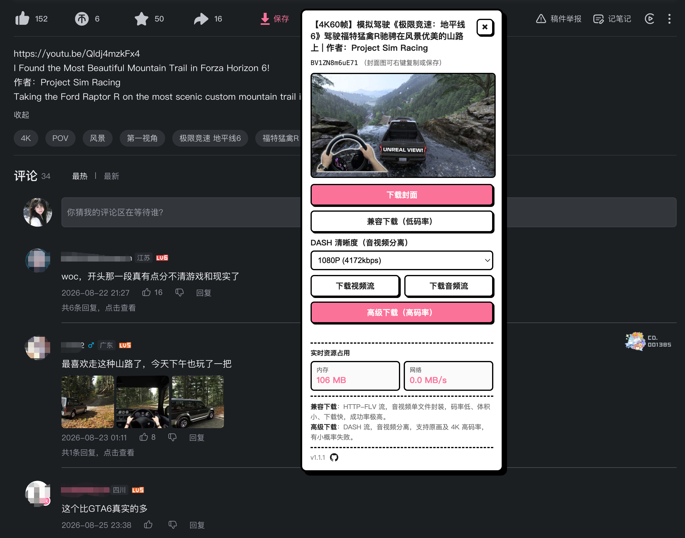

# 哔哩喵 (Bili-Mux)

<p align="center"></p>

[English](./README.en.md) | **中文**

## 下载插件

[⬇️ 下载 Bili-Mux v1.2.3（.crx）](https://github.com/c-yyy/bili-mux/raw/main/Bili-Mux-v1.2.3.crx)

📄 [隐私政策](https://c-yyy.github.io/bili-mux/privacy.html)

### 安装教程

1. 打开 Chrome，地址栏输入 `chrome://extensions/` 并开启右上角「开发者模式」。
2. 将下载的 `Bili-Mux-v1.2.3.crx` 拖入页面，点击「添加扩展程序」。
3. 打开任意 B站视频页（需已登录），工具栏末尾出现粉色「保存」按钮即安装成功。

一个 Manifest V3 Chrome 扩展，在 B站视频页注入下载面板，支持封面下载、DASH 音视频流分离保存、浏览器内 ffmpeg.wasm 合成 MP4、FLV 合并下载。

**支持的页面**：普通视频页 `/video/BVxxx`、`/video/av123`，「稍后再看」/「收藏夹」/「播单」等 `/list/*` 播放页（这类页面的视频 ID 在 URL 参数里，切换下一集时会自动重新解析），**番剧/影视页** `/bangumi/play/ss109700`、`/bangumi/play/ep321808`，以及**课程页** `/cheese/play/ss20821`、`/cheese/play/ep712007`。

> 番剧走 PGC 接口（`pgc/view/web/season` + `pgc/player/web/v2/playurl`），课程走 PUGV 接口，二者面板都会多出一个「选集 / 课程目录」下拉。**会员专享剧集、付费课程都需要账号本身有对应权益**，下载器只能拿到当前账号能播放的那一路。

> **仅供个人学习留存使用，请勿用于批量搬运或二次分发。**

## 功能一览

<p align="center"></p>

| 功能 | 说明 |
|------|------|
| 封面下载 | 静态直链，`chrome.downloads` 直接落地 |
| DASH 视频流 | 视频流 `.m4s` 单独保存（可选画质至 4K） |
| DASH 音频流 | 音频流 `.m4s` 单独保存 |
| 浏览器内合成 MP4 | 拉取音视频流后用 ffmpeg.wasm（Offscreen Document）封装为单个 MP4，无需本机安装 ffmpeg |
| FLV 合并下载 | 旧版 HTTP-FLV 分段二进制拼接，低码率、体积小（番剧一般不提供，此时该按钮会自动隐藏） |
| 番剧选集 | 番剧页列出全部剧集，下拉切换后自动重新取该集直链 |
| 实时资源占用 | 面板显示本扩展内存占用与网络下载速率 |

## 安装

1. 下载本项目到本地。
2. 打开 Chrome，进入 `chrome://extensions/`。
3. 开启右上角「开发者模式」。
4. 点击「加载已解压的扩展程序」，选择项目根目录。
5. 打开任意 `bilibili.com/video/` 页面（需已登录），视频工具栏末尾会出现粉色「保存」按钮。

**环境要求**：Chrome 116+（浏览器内合成依赖 Offscreen Document API）。

## 使用方法

1. 在 B站视频页点击工具栏的粉色「保存」按钮，展开面板。
2. **合成 MP4**：选择清晰度 → 点击「合成 MP4（浏览器内）」→ 进度条完成后自动下载。
3. **分离下载**：点击「下载视频流」/「下载音频流」，分别得到 `.m4s` 文件，可用本地 ffmpeg 合并：
   ```bash
   ffmpeg -i video.m4s -i audio.m4s -c copy output.mp4
   ```
4. **FLV 合并**：点击「FLV 合并下载（低码率）」，直接得到可播放的 `.flv` 文件。

## 项目结构

```
bili-downloader/
├── manifest.json          # MV3 清单：权限、content_scripts、offscreen、CSP
├── content.js             # 注入 B站视频页的 content script（解析 + 面板 UI + 下载）
├── background.js          # Service Worker：chrome.downloads 落地 + Offscreen 生命周期管理
├── offscreen.js           # Offscreen Document：承载 ffmpeg.wasm 合成 MP4
├── offscreen.html         # Offscreen 页面（加载 ffmpeg.min.js + offscreen.js）
├── popup.html / .js / .css  # 扩展弹窗：版本号、使用说明、快捷入口
├── rules.json             # declarativeNetRequest 规则：为 CDN 请求注入 Referer 头
├── lib/ffmpeg/            # @ffmpeg/ffmpeg 0.11 + @ffmpeg/core-st（单线程 wasm）
├── icons/                 # 扩展图标
└── tools/gen-icons.js     # 图标生成脚本
```

## 技术要点

### WBI 签名

B站 `playurl` 接口需要 WBI 签名。扩展内置 `MIXIN_TAB` 混淆表，从 `nav` 接口获取 `img_url` / `sub_url` 提取密钥，按位重排后截取 32 位，对请求参数排序拼接后 MD5 签名。密钥缓存 10 分钟。

### DASH 与 FLV

- **DASH**：视频与音频分离为独立流（`.m4s`），可拿到原画画质乃至 4K。合成 MP4 需用 ffmpeg 封装。
- **FLV**：旧版 HTTP-FLV 将音视频封装在同一容器，多个分段可直接二进制拼接为可播放文件，码率较低。

### 浏览器内 ffmpeg.wasm 合成

使用 `@ffmpeg/ffmpeg` 0.11 + `@ffmpeg/core-st`（单线程 core），在 MV3 Offscreen Document 中运行：

- 单线程 core 不依赖 `SharedArrayBuffer`，无需 COOP/COEP 响应头。
- 跨进程二进制载荷（content → SW → offscreen）一律 base64 编码，因为 `chrome.runtime.sendMessage` 不支持 ArrayBuffer 序列化。
- 合成后实例保留复用（`FFMPEG_END` 已复位 running 标志），仅失败时销毁重建。
- 进度回调从 `{ratio, time}` 对象中提取数值，过滤 NaN 后转发。

### Referer 注入

B站媒体 CDN（`bilivideo.com` 等）校验 Referer。`chrome.downloads` 发起的下载无来源页面、不携带 Referer，会返回 403。解决方案：

- **流式下载**（合成 MP4 / 分离下载）：在 content script 内 `fetch`（浏览器自动带 Referer）→ Blob 落地。
- **declarativeNetRequest**（`rules.json`）：为 `bilivideo` 域名的 `media` / `xmlhttprequest` 请求注入 `Referer: https://www.bilibili.com`。

### 多标签隔离

每个合成请求带唯一 `requestId`，`background.js` 维护 `requestId → tabId` 映射，合成结果按 `requestId` 定向 `chrome.tabs.sendMessage` 转发，避免多标签串台或重复下载。

## 权限说明

| 权限 | 用途 |
|------|------|
| `downloads` | 调用 `chrome.downloads.download` 落地文件 |
| `declarativeNetRequestWithHostAccess` | 注入 Referer 规则 |
| `offscreen` | 创建 Offscreen Document 跑 ffmpeg.wasm |
| `host_permissions`（bilibili.com / bilivideo.com / hdslb.com） | 携带登录态 fetch API + 拉取媒体流 |

## 更新日志

### v1.2.3（2026-09-12）

- **修复商店审核「包含远程托管代码」拒审**：`@ffmpeg/ffmpeg` 的发布包内置一个把 `corePath` 指向 `https://unpkg.com/@ffmpeg/core@` 的默认配置。本项目运行时始终显式传本地路径，不会真的联网取，但商店是静态扫描、见该直链即判违规。现由 `tools/patch-ffmpeg.js` 在打包时把它改写成包内自带的 core，并去掉指向不存在资源的 sourceMappingURL 注释
- **收紧 `web_accessible_resources`**：原先 `lib/ffmpeg/*` 对 `<all_urls>` 开放。ffmpeg 全套只在扩展自有页面（Offscreen Document）内加载，本就不需要对外暴露；现仅保留 `icons/icon128.png`（面板图标）且限定 `*.bilibili.com`
- 新增 `tools/patch-ffmpeg.js`（幂等，已接入 pack.sh / zip.sh）与 `tools/verify-extension.js`（真机加载扩展做冒烟校验）

### v1.2.2（2026-09-10）

- **修复高级下载偶发失败「Extension context invalidated」**：扩展被更新/重载后，已注入的 content script 会变孤儿，拉流（纯 fetch）能跑完、直到分块传输才报错，用户白等几百 MB。现在动作开头即预检上下文，失效时跳过拉流直接提示刷新；消息发送对瞬时错误自动重试一次
- **失败处新增重试按钮**：解析 / 拉流 / 传输 / 合成 / 等待超时 / 封面 / 分离下载 / FLV 合并失败时，状态文字旁出现重试按钮，点击重跑对应动作；上下文失效场景按钮变为「刷新页面」
- **Service Worker 重启不再丢失合成结果**：tabId 编入 requestId，SW 被回收后仍能反解目标标签回传结果（不新增任何权限）；offscreen 分块按 index 去重，避免自动重发导致合成体积翻倍
- **工具栏图标默认色改为 `#61666d`**：与 B站原生工具栏同款灰，悬停时图标与文字一起变品牌粉

### v1.2.1（2026-09-09）

- **工具栏图标更新**：换成圆形下载图标（实心圆底 + 镂空箭头），尺寸 20px → 28px；图标颜色跟随按钮的静态/悬停配色
- **文案改写**：扩展描述与商店介绍文案重写，去掉 `DASH`、`ffmpeg.wasm`、`Offscreen Document` 等技术术语，改为面向普通用户的表达，并补充番剧与课程支持说明

### v1.2.0（2026-09-08）

- **新增番剧 / 影视支持**：`/bangumi/play/ss*`、`/ep*` 走 PGC 接口链，面板新增「选集」下拉；会员专享（`-10403`）、试看片段（`PLAY_PREVIEW`）、风控等给出明确提示
- **新增课程支持**：`/cheese/play/*` 走 PUGV 接口链，面板显示「课程目录」；未购买课程给出「需购买」而非「大会员」提示
- **CDN 节点轮换容错**：修复主 CDN 节点故障即整次下载失败的问题，依次尝试备用节点（网络层错误 / 5xx / 超时换节点，4xx 立即放弃）
- **工具栏按钮对齐优化**：克隆参考元素样式 + 运行时几何校正，与点赞/投币/收藏同排等高；移除悬停边框与动画特效，仅保留变色
- **清晰度与文件名优化**：下拉选项显示清晰度名、分辨率、码率；下载文件名统一为「标题_清晰度_视频ID」格式（番剧/课程带上 `ep` 号）；修复 HDR 档被误设为默认的问题
- 修复 `/list/*` 播放页与番剧页 SPA 切集时面板不重新解析的隐蔽 bug

### v1.1.3

- 移除未使用的 `scripting` 权限、清理冗余 `host_permissions`（应对 Chrome 商店审核驳回）

### v1.1.2

- 支持 `av` 号解析（经 view 接口转 BV 并缓存）；WBI 签名失败自动重试与 412 风控降级；CDN 直链 `http→https` 升级

### v1.1.1

- 工具栏按钮文案「下载」→「保存」

### v1.1.0

- 首个发布版本：封面下载、DASH 音视频分离保存、浏览器内 ffmpeg.wasm 合成 MP4、FLV 合并下载、实时资源占用

## 免责声明

本工具仅解析用户账号本就有权播放的流，用于个人留存与学习。请勿用于批量搬运或二次分发，由此产生的版权/账号风险由使用者自行承担。
