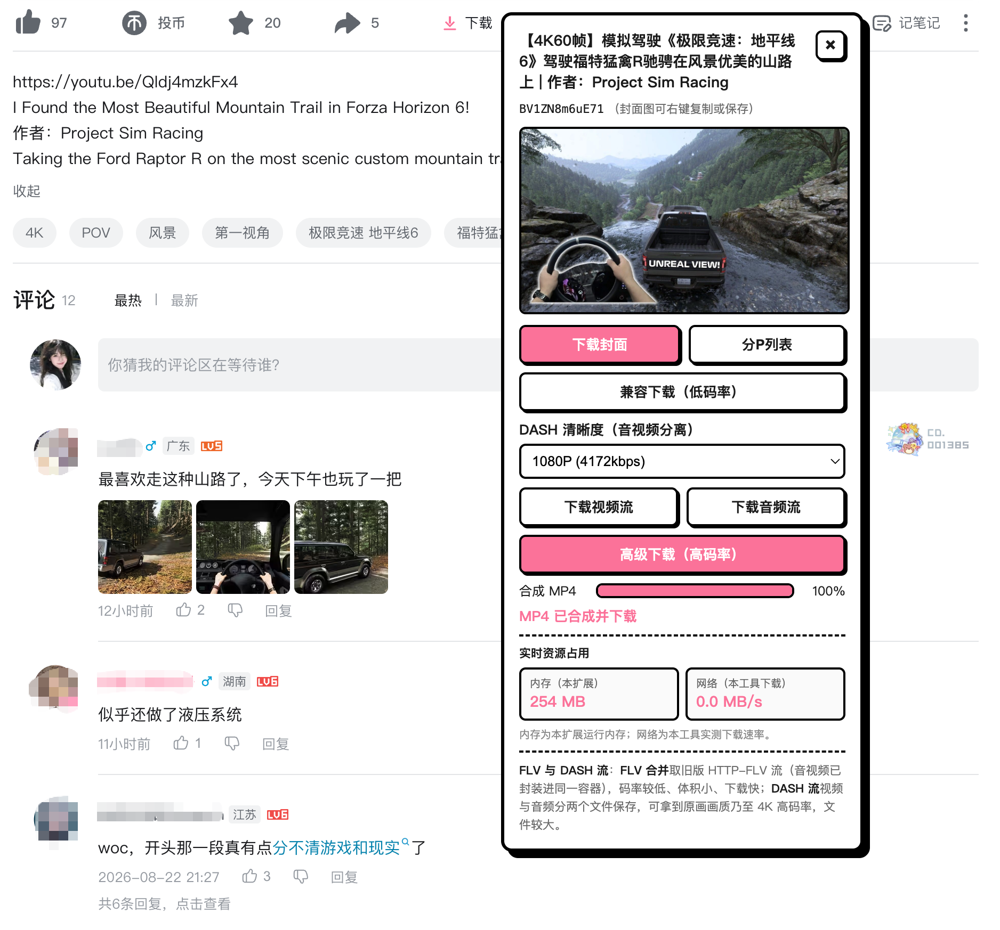

# 哔哩喵 (Bili-Mux)

<p align="center"></p>

[English](./README.en.md) | **中文**

## 下载插件

[⬇️ 下载 Bili-Mux v1.1.0（.crx）](https://github.com/c-yyy/bili-mux/raw/main/Bili-Mux-v1.1.0.crx)

📄 [隐私政策](https://c-yyy.github.io/bili-mux/privacy.html)

一个 Manifest V3 Chrome 扩展，在 B站视频页注入下载面板，支持封面下载、DASH 音视频流分离保存、浏览器内 ffmpeg.wasm 合成 MP4、FLV 合并下载与分P批量下载。

> **仅供个人学习留存使用，请勿用于批量搬运或二次分发。**

## 功能一览

<p align="center"></p>

| 功能 | 说明 |
|------|------|
| 封面下载 | 静态直链，`chrome.downloads` 直接落地 |
| DASH 视频流 | 视频流 `.m4s` 单独保存（可选画质至 4K） |
| DASH 音频流 | 音频流 `.m4s` 单独保存 |
| 浏览器内合成 MP4 | 拉取音视频流后用 ffmpeg.wasm（Offscreen Document）封装为单个 MP4，无需本机安装 ffmpeg |
| FLV 合并下载 | 旧版 HTTP-FLV 分段二进制拼接，低码率、体积小 |
| 分P批量下载 | 勾选多个分P，逐个 FLV 合并下载 |
| 实时资源占用 | 面板显示本扩展内存占用与网络下载速率 |

## 安装

1. 下载本项目到本地。
2. 打开 Chrome，进入 `chrome://extensions/`。
3. 开启右上角「开发者模式」。
4. 点击「加载已解压的扩展程序」，选择项目根目录。
5. 打开任意 `bilibili.com/video/` 页面（需已登录），视频工具栏末尾会出现粉色「下载」按钮。

**环境要求**：Chrome 116+（浏览器内合成依赖 Offscreen Document API）。

## 使用方法

1. 在 B站视频页点击工具栏的粉色「下载」按钮，展开面板。
2. **合成 MP4**：选择清晰度 → 点击「合成 MP4（浏览器内）」→ 进度条完成后自动下载。
3. **分离下载**：点击「下载视频流」/「下载音频流」，分别得到 `.m4s` 文件，可用本地 ffmpeg 合并：
   ```bash
   ffmpeg -i video.m4s -i audio.m4s -c copy output.mp4
   ```
4. **FLV 合并**：点击「FLV 合并下载（低码率）」，直接得到可播放的 `.flv` 文件。
5. **分P批量**：点击「分P列表」→ 勾选分P → 「批量下载选中」。

## 项目结构

```
bili-downloader/
├── manifest.json          # MV3 清单：权限、content_scripts、offscreen、CSP
├── content.js             # 注入 B站视频页的 content script（解析 + 面板 UI + 下载）
├── background.js          # Service Worker：chrome.downloads 落地 + Offscreen 生命周期管理
├── offscreen.js           # Offscreen Document：承载 ffmpeg.wasm 合成 MP4
├── offscreen.html         # Offscreen 页面（加载 ffmpeg.min.js + offscreen.js）
├── popup.html / .js / .css  # 扩展弹窗：版本号、使用说明、快捷入口
├── rules.json             # declarativeNetRequest 规则：为 CDN 请求注入 Referer 头
├── lib/ffmpeg/            # @ffmpeg/ffmpeg 0.11 + @ffmpeg/core-st（单线程 wasm）
├── icons/                 # 扩展图标
└── tools/gen-icons.js     # 图标生成脚本
```

## 技术要点

### WBI 签名

B站 `playurl` 接口需要 WBI 签名。扩展内置 `MIXIN_TAB` 混淆表，从 `nav` 接口获取 `img_url` / `sub_url` 提取密钥，按位重排后截取 32 位，对请求参数排序拼接后 MD5 签名。密钥缓存 10 分钟。

### DASH 与 FLV

- **DASH**：视频与音频分离为独立流（`.m4s`），可拿到原画画质乃至 4K。合成 MP4 需用 ffmpeg 封装。
- **FLV**：旧版 HTTP-FLV 将音视频封装在同一容器，多个分段可直接二进制拼接为可播放文件，码率较低。

### 浏览器内 ffmpeg.wasm 合成

使用 `@ffmpeg/ffmpeg` 0.11 + `@ffmpeg/core-st`（单线程 core），在 MV3 Offscreen Document 中运行：

- 单线程 core 不依赖 `SharedArrayBuffer`，无需 COOP/COEP 响应头。
- 跨进程二进制载荷（content → SW → offscreen）一律 base64 编码，因为 `chrome.runtime.sendMessage` 不支持 ArrayBuffer 序列化。
- 合成后实例保留复用（`FFMPEG_END` 已复位 running 标志），仅失败时销毁重建。
- 进度回调从 `{ratio, time}` 对象中提取数值，过滤 NaN 后转发。

### Referer 注入

B站媒体 CDN（`bilivideo.com` 等）校验 Referer。`chrome.downloads` 发起的下载无来源页面、不携带 Referer，会返回 403。解决方案：

- **流式下载**（合成 MP4 / 分离下载）：在 content script 内 `fetch`（浏览器自动带 Referer）→ Blob 落地。
- **declarativeNetRequest**（`rules.json`）：为 `bilivideo` 域名的 `media` / `xmlhttprequest` 请求注入 `Referer: https://www.bilibili.com`。

### 多标签隔离

每个合成请求带唯一 `requestId`，`background.js` 维护 `requestId → tabId` 映射，合成结果按 `requestId` 定向 `chrome.tabs.sendMessage` 转发，避免多标签串台或重复下载。

## 权限说明

| 权限 | 用途 |
|------|------|
| `downloads` | 调用 `chrome.downloads.download` 落地文件 |
| `scripting` | 注入 content script |
| `declarativeNetRequestWithHostAccess` | 注入 Referer 规则 |
| `offscreen` | 创建 Offscreen Document 跑 ffmpeg.wasm |
| `host_permissions`（bilibili.com / bilivideo.com / hdslb.com） | 携带登录态 fetch API + 拉取媒体流 |

## 免责声明

本工具仅解析用户账号本就有权播放的流，用于个人留存与学习。请勿用于批量搬运或二次分发，由此产生的版权/账号风险由使用者自行承担。
